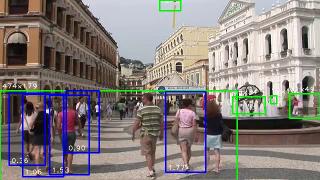
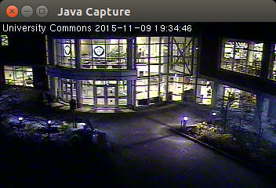
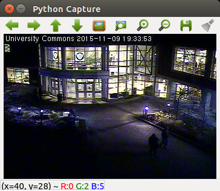
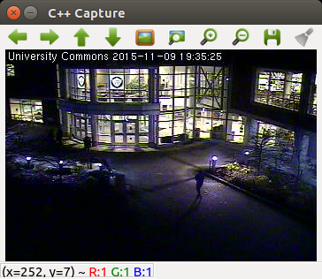
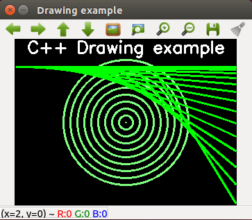

If you are interested in compiling the latest version of OpenCV (currently OpenCV 4.5.x) for ARM based SBCs or x86 computers then this project will show you how. You should be experienced with Linux, OpenCV and Python (or Java or C++) to make the most of this project. I have created a set of scripts that automate the install process. The scripts support Ubuntu 20.04, Debian GNU/Linux 9 and probably other distributions. x86, x86_64, ARMV7 and ARMV8 are currently working.



The image above is a screenshot of a video frame that has been processed by [Motion Detector](https://github.com/sgjava/motiondetector).
Motion is bounded by green boxes and pedestrians by blue boxes.

* [Provides](#provides)
* [Test Camera](#test-camera)
* [Download project](#download-project)
* [Install The Whole Enchilada](#install-the-whole-enchilada)
* [Install Java and Ant](#install-java-and-ant)
* [Install libjpeg-turbo](#install-libjpeg-turbo)
* [Install mjpg-streamer](#install-mjpg-streamer)
* [Install OpenCV](#install-opencv)
* [Java](#java)
* [Python](#python)
* [C++](#c)  
* [FreeBSD License](#freebsd-license)

### Provides
* Latest Zulu OpenJDK 17 (Zulu OpenJDK 11 for armv7) and Apache Ant
    * FourCC class
    * CaptureUI Applet to view images/video since there's no imshow with the bindings
* Latest libjpeg-turbo optimized for SIMD
    * Patch to mute common warnings that will fill up the logs
* Latest mjpg-streamer fork optimized with libjpeg-turbo
* Latest OpenCV with opencv_contrib optimized for libjpeg-turbo
* Python application provides motion, pedestrian (HOG) and Haar Cascade detection
* Java, Python and C++ examples can be easily run from Eclipse.
    * Capture UI
    * Motion detection
    * People detection
    * Camera Calibration
    * Drawing

### Test Camera
If you plan on processing only video or image files then you can skip this section. Live video will allow you to create smart camera applications that react to a live video stream (versus a streaming only camera). You will need to select a USB camera that works under [Linux](http://elinux.org/RPi_USB_Webcams) and has the proper resolution.
* Add user to video group
    * `sudo usermod -a -G video username`
* Install uvcdynctrl v4l-utils
    * `sudo apt install uvcdynctrl v4l-utils`
* Reboot
    * `sudo reboot`
* Get camera information (using a cheap Kinobo Origami Webcam here for illustration)
    * `lsusb`
         * `Bus 003 Device 002: ID 1871:0142 Aveo Technology Corp.`
    * `uvcdynctrl -f`
         * `Pixel format: YUYV (YUYV 4:2:2; MIME type: video/x-raw-yuv)`
    * `v4l2-ctl --list-formats-ext`

### Download project
* `sudo apt install git`
* `cd ~/`
* `git clone --depth 1 https://github.com/sgjava/install-opencv.git`
* On ARM platforms with limited memory create a swap file or the build may fail
with an out of memory exception. To create a 1GB swap file use:
    * `sudo su -`
    * `dd if=/dev/zero of=tmpswap bs=1024 count=1M`
    * `chmod 600 tmpswap`
    * `mkswap tmpswap`
    * `swapon tmpswap`
    * `free`
* If you reach the thermal limit for your board it might shut down/reboot during the compile since all CPUs are used for the build process. Lower the
maximum CPU clock speed available with your CPU governor and try build again.

### Install The Whole Enchilada
This is probably the easiest way to install everything, but you can follow the individual steps below to build or rebuild individual components. There are values you can change in the individual scripts, so read them over. Skip the rest of the individual scripts below if you run this.
* `cd ~/install-opencv/scripts`
* Edit `config.sh` and make changes as needed
* Edit `install-opencv.sh` and change version as needed.
* `./install.sh`
    * Use `top` to monitor until build completes

### Install Java and Ant
* `cd ~/install-opencv/scripts`
* `./install-java.sh`
* `java -version`
* `ant -version`

### Install libjpeg-turbo
Patches jdhuff.c to remove "Invalid SOS parameters for sequential JPEG" warning and jdmarker.c to remove "Corrupt JPEG data: xx extraneous bytes before marker 0xd9" warning. These will fill up the logs if not muted.
* `cd ~/install-opencv/scripts`
* `./install-libjpeg-turbo.sh`
    * Use `top` to monitor until build completes

### Install mjpg-streamer
Sometimes all you need is a live video feed without further processing. This section will be what you are looking for. It also makes sense to move the UVC processing into a different Linux process or thread from the main CV code.

#### WARNING
I'm running this on a test LAN and not securing mjpg-streamer. In production you will want to use a user and password with mjpg-streamer. You will also want to put it behind a secure proxy if you are accessing it from the Internet.
* `cd ~/install-opencv/scripts`
* `./install-mjpg-streamer.sh`
    * Runtime ~3 minutes
* `v4l2-ctl --list-formats`
    * Check Pixel Format for 'YUYV' and/or 'MJPG'
* To run mjpg-streamer with 'YUYV' only camera use
    * `mjpg_streamer -i "/usr/local/lib/mjpg-streamer/input_uvc.so -y" -o "/usr/local/lib/mjpg-streamer/output_http.so -w /usr/local/www"`
* To run mjpg-streamer with 'MJPG' use
    * `mjpg_streamer -i "/usr/local/lib/mjpg-streamer/input_uvc.so" -o "/usr/local/lib/mjpg-streamer/output_http.so -w /usr/local/www"`
* In your web browser or VLC player go to `http://yourhost:8080/?action=stream` and you should see the video stream.

### Install OpenCV
* `cd ~/install-opencv/scripts`
* `./install-opencv.sh`
    * Use `top` to monitor until build completes

### Java
To run Java programs in Eclipse you need add the OpenCV library.
* Window, Preferences, Java, Build Path, User Libraries, New..., OpenCV, OK
* Add External JARs..., ~/opencv/build/bin/opencv-453.jar
* Native library location, Edit..., External Folder..., ~/opencv/build/lib, OK
* Import [Eclipse project](https://github.com/sgjava/install-opencv/tree/master/java)

To run compiled class (Canny for this example) from shell:
* `cd ~/install-opencv/opencv-java`
* `java -Djava.library.path=/home/<username>/opencv/build/lib -cp /home/<username>/opencv/build/bin/opencv-430.jar:bin com.codeferm.opencv.Canny`

#### Things to be aware of
* There are no bindings generated for OpenCV's GPU module.
* Understand how memory management [works](https://github.com/sgjava/opencvmem)
* Make sure you call Mat.release() to free native memory
* The JNI code can modify variables with the final modifier. You need to be aware of the implications of this since it is not normal Java behavior.



### Python
To run Python programs in Eclipse you need [PyDev](http://pydev.org) installed.
* Help, Install New Software..., Add..., Name: PyDev, Location: http://pydev.org/updates, OK, check PyDev, Next>, Next>, I accept the terms of the license agreement, Finish, Trust certificate, OK
* Import [Eclipse project](https://github.com/sgjava/install-opencv/tree/master/opencv-python)



`-m cProfile -s time` is used to profile.

### C++
To create a new C++ project in Eclipse you need to install CDT plugin first (or use the Eclipse IDE for C/C++ Developers). I'm using the Eclipse IDE for Java EE Developers, so I installed the CDT plugin.
* Help, Eclipse Marketplace..., Add..., Find: ide cdt, click Go, OK, select Eclipse CDT (C/C++ Development Tooling) and click Install, Next, Next, I accept the terms of the license agreement, Finish, Yes

To run C++ example projects
* Import [Eclipse projects](https://github.com/sgjava/install-opencv/tree/master/opencv-cpp) one at a time



To create new C++ project
* Change to C/C++ perspcetive, File, New, C++ Project, Project name: test, Hello World C++ Project, GCC C++ Compiler, Next, Next, Next, Finish
* Right click project, Properties, C/C++ Build, Settings, GCC C++ Compiler, Includes, Include paths(-l), click +, Directory: /usr/local/include/opencv4, click OK
* Right click project, Properties, C/C++ Build, Settings, GCC C++ Linker, Libraries, Library search path (-L), click +, Directory: /usr/local/lib, OK
* Right click project, Properties, C/C++ Build, Settings, GCC C++ Linker, Libraries, Libraries(-l), click +, Libraries(-l): opencv_core, repeat for other libraries such as opencv_imgproc opencv_highgui, OK
* Open test.cpp and replace all the text with:
```
#include <opencv2/opencv.hpp>

using namespace cv;

int main() {
	// Create black empty image
	Mat image = Mat::zeros(240, 320, CV_8UC3);
	// Draw circles
	for (int a = 0; a < 10; a = a + 1) {
		circle(image, Point(160, 120), 10.0 * a, Scalar(128, 128, 255), 2, 8);
	}
	// Draw lines
	for (int a = 0; a < 15; a = a + 1) {
		line(image, Point(2 + a * a, 40), Point(318, 40 + a * a), Scalar(0, 255, 0),
				2, 8);
	}
	// Draw text
	putText(image, "C++ Drawing example", Point(18, 20), FONT_HERSHEY_SIMPLEX,
			0.8, Scalar(255, 255, 255), 2);
	// Show image
	imshow("Drawing example", image);
	// Wait for key press
	waitKey();
	return 0;
}
```
* Save file, right click project, Build Configurations..., Build Selected..., OK
* Right click project, Run As, Local C/C++ Application



### FreeBSD License
Copyright (c) Steven P. Goldsmith

All rights reserved.

Redistribution and use in source and binary forms, with or without modification, are permitted provided that the following conditions are met:
* Redistributions of source code must retain the above copyright notice, this list of conditions and the following disclaimer.
* Redistributions in binary form must reproduce the above copyright notice, this list of conditions and the following disclaimer in the documentation and/or other materials provided with the distribution.

THIS SOFTWARE IS PROVIDED BY THE COPYRIGHT HOLDERS AND CONTRIBUTORS "AS IS" AND ANY EXPRESS OR IMPLIED WARRANTIES, INCLUDING, BUT NOT LIMITED TO, THE IMPLIED WARRANTIES OF MERCHANTABILITY AND FITNESS FOR A PARTICULAR PURPOSE ARE DISCLAIMED. IN NO EVENT SHALL THE COPYRIGHT HOLDER OR CONTRIBUTORS BE LIABLE FOR ANY DIRECT, INDIRECT, INCIDENTAL, SPECIAL, EXEMPLARY, OR CONSEQUENTIAL DAMAGES (INCLUDING, BUT NOT LIMITED TO, PROCUREMENT OF SUBSTITUTE GOODS OR SERVICES; LOSS OF USE, DATA, OR PROFITS; OR BUSINESS INTERRUPTION) HOWEVER CAUSED AND ON ANY THEORY OF LIABILITY, WHETHER IN CONTRACT, STRICT LIABILITY, OR TORT (INCLUDING NEGLIGENCE OR OTHERWISE) ARISING IN ANY WAY OUT OF THE USE OF THIS SOFTWARE, EVEN IF ADVISED OF THE POSSIBILITY OF SUCH DAMAGE.
